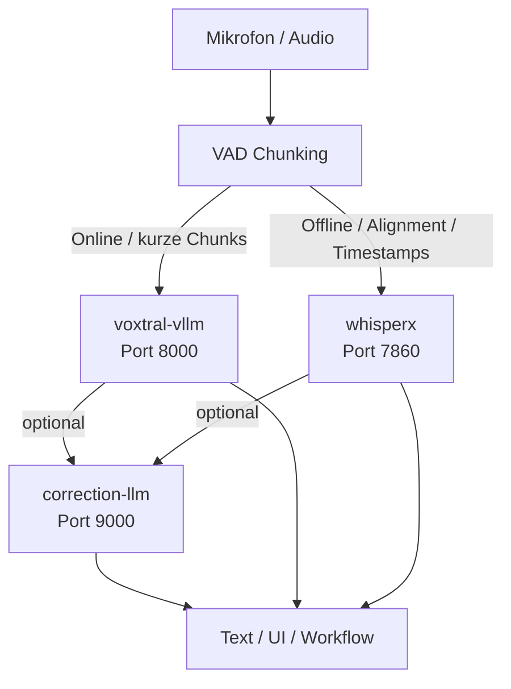

# DGX Spark AI Stack

Dieses Setup ergänzt den bestehenden Voxtral-Pfad um zwei weitere Dienste auf dem DGX Spark:

- Mistral-Transcribe / Voxtral über vLLM auf Port `8000`
- WhisperX mit Timestamps und Worker-Pool auf Port `7860`
- optional: OpenAI-kompatibles Korrektur-LLM über vLLM auf Port `9000`
- Spark Admin Webserver auf Port `7000`

## Zielbild

- `voxtral-vllm` liefert schnelle OpenAI-kompatible Audio-Transkription für Mistral/Voxtral.
- `whisperx` liefert segmentierte Timestamps.
- optional kann `correction-llm` `/v1/models` und `/v1/chat/completions` für Textkorrektur oder Review liefern.
- `spark-admin` liefert ein Web-Dashboard für Status, Logs, Konfigurationen und Service-Steuerung.

### Empfohlener Betriebsmodus

- Online-Diktat parallel für mehrere Nutzer: `voxtral-vllm` + `correction-llm`
- Offline-/Batch-Transkription: `whisperx` sequentiell, idealerweise ohne gleichzeitig laufendes großes Korrekturmodell
- Das Default-Setup ist deshalb auf einen gemeinsamen Betrieb von Voxtral plus Korrekturmodell optimiert, nicht auf maximale Größe jedes einzelnen Dienstes.

### Benchmark-Fazit für kurzen VAD-Chunk-Online-Modus

Für den hier genutzten Echtbetrieb mit kurzen, bereits per VAD segmentierten Sätzen bleibt `voxtral-vllm` klar der bessere Primärdienst.
Die Messung wurde mit kurzer MP3-Testdatei (`audio_test.mp3`) und 30 Sekunden Lastdauer pro Stufe auf dem DGX Spark durchgeführt.

| Nutzer | Voxtral Ø Latenz | Voxtral Throughput | WhisperX Ø Latenz | WhisperX Throughput |
|---:|---:|---:|---:|---:|
| 1 | `0.31s` | `2.48 r/s` | `0.48s` | `1.70 r/s` |
| 2 | `0.34s` | `4.75 r/s` | `0.76s` | `2.23 r/s` |
| 3 | `0.33s` | `7.18 r/s` | `1.13s` | `2.28 r/s` |
| 4 | `0.33s` | `9.74 r/s` | `1.52s` | `2.28 r/s` |
| 5 | `0.33s` | `11.92 r/s` | `1.94s` | `2.30 r/s` |
| 6 | `0.34s` | `14.07 r/s` | `2.24s` | `2.38 r/s` |

Interpretation:

- `voxtral-vllm` hält die Latenz auch bei `6` parallelen Nutzern praktisch stabil bei rund `0.33–0.34s`.
- `whisperx` skaliert im selben Test deutlich schlechter und steigt von `0.48s` auf `2.24s`.
- Die GPU-Auslastung lag bei Voxtral stabil bei ca. `92%`, bei WhisperX je nach Stufe nur bei ca. `38–62%`.
- Für kurze Online-Chunks ist damit nicht die reine Modellgröße entscheidend, sondern wie gut der Dienst viele kleine Requests parallel abarbeitet.

Praxisempfehlung:

- `voxtral-vllm` als Primärpfad für Online-/Realtime-nahe VAD-Chunks
- `whisperx` ergänzend für Alignment, Wort-Timestamps oder Offline-Nachbearbeitung

### Empfohlene Betriebsstrategie

Für den produktiven Betrieb auf dem DGX Spark empfiehlt sich folgende einfache Aufteilung:

- **Online, kurzer VAD-Chunk, schnelle Reaktion wichtig** → `voxtral-vllm`
- **Online, kurzer Chunk plus nachgelagerte Textkorrektur** → `voxtral-vllm` + `correction-llm`
- **Offline-Transkription mit Wort-/Segment-Timestamps** → `whisperx`
- **Offline-Qualitätssicherung oder Text-Review nach STT** → `voxtral-vllm` oder `whisperx` + `correction-llm`

Konkrete Routing-Regeln:

1. Alles, was schon per VAD in kurze Sätze oder sehr kurze Sprachsegmente zerlegt wurde, zuerst an `voxtral-vllm` schicken.
2. `whisperx` nur dann im Primärpfad verwenden, wenn Timestamps oder Alignment fachlich wirklich benötigt werden.
3. Bei hoher Parallelität zuerst Voxtral skalieren, nicht WhisperX.
4. WhisperX bevorzugt als separaten Offline- oder Nachbearbeitungs-Job laufen lassen.

### Architekturdiagramm

```text
			  +----------------------+
			  |   Mikrofon / Audio   |
			  +----------+-----------+
					 |
					 v
			  +----------------------+
			  |     VAD Chunking     |
			  +-----+-----------+----+
				  |           |
	    Online / kurze Chunks       | Offline / Alignment / Timestamps
				  |           |
				  v           v
		  +----------------+   +----------------+
		  |  voxtral-vllm  |   |    whisperx    |
		  |   Port 8000    |   |   Port 7860    |
		  +--------+-------+   +--------+-------+
			     |                    |
			     | optional           | optional
			     v                    v
		    +-------------------------------+
		    |       correction-llm          |
		    |          Port 9000            |
		    +---------------+---------------+
					  |
					  v
			  +----------------------+
			  | Text / UI / Workflow |
			  +----------------------+
```



## Deployment

Vom Windows-Rechner aus:

```powershell
pwsh -File .\scripts\deploy_voxtral_to_dgx.ps1 -RemoteUser <dein-user>
```

Dadurch landen auf dem Spark unter `~/voxtral-setup`:

- `voxtral_server.py`
- `scripts/03_install_voxtral_dgx_spark.sh`
- `scripts/04_install_voxtral_dgx_spark_container.sh`
- `scripts/05_install_whisperx_dgx_spark.sh`
- `scripts/09_install_gemma4_dgx_spark.sh` (ersetzt das alte `06_install_correction_llm_dgx_spark.sh`)
- `scripts/07_install_dgx_spark_ai_stack.sh`
- `scripts/08_install_spark_admin_dgx_spark.sh`
- `spark_admin/`
- `whisperx_spark/`

## Installationsreihenfolge

Auf dem DGX Spark:

```bash
cd ~/voxtral-setup
chmod +x *.sh
./04_install_voxtral_dgx_spark_container.sh
./05_install_whisperx_dgx_spark.sh
./09_install_gemma4_dgx_spark.sh            # Gemma 4 26B MoE (NVFP4) als Korrektur-LLM
./08_install_spark_admin_dgx_spark.sh
```

Alternativ als Sammelaufruf:

```bash
./07_install_dgx_spark_ai_stack.sh
```

## Ports

| Dienst | Port | Zweck |
|---|---:|---|
| Voxtral / vLLM | `8000` | OpenAI-kompatible Audio-Transkription |
| WhisperX | `7860` | Gradio-UI + API mit Timestamps |
| Korrektur-LLM | `9000` | optionale OpenAI-kompatible Textkorrektur |
| Spark Admin | `7000` | Web-UI für Betrieb, Logs und Konfiguration |
| Gemma 4 MoE LLM | `9000` | Korrektur-LLM (NVFP4, ~16 GB, natives Gemma4ForCausalLM) |

## Starten und prüfen

```bash
sudo systemctl start voxtral-vllm whisperx
sudo systemctl status voxtral-vllm whisperx --no-pager -l
```

Spark Admin:

```bash
sudo systemctl start spark-admin
sudo systemctl status spark-admin --no-pager -l
```

Voxtral:

```bash
curl http://127.0.0.1:8000/health
```

WhisperX:

```bash
curl -I http://127.0.0.1:7860
```

Optionales Korrektur-LLM:

```bash
curl http://127.0.0.1:9000/v1/models
```

Spark Admin:

```bash
curl -I http://127.0.0.1:7000/login
```

Login erfolgt mit Linux-Benutzername und Passwort des Spark. Der Dienst speichert keine sudo-Credentials.

## WhisperX-API

Das Spark-Backend orientiert sich an der bisherigen WhisperX-Gradio-API.
Wichtiger Endpoint:

- `POST /gradio_api/call/start_process`

Im UI ist derselbe Prozess unter Port `7860` verfügbar.
Zusätzlich gibt es Admin-Funktionen für:

- `system_cleanup`
- `system_kill_zombies`
- `system_reboot`
- `system_pool_status`

## Parallelität und Sizing

Wichtiger Punkt: Alle drei Dienste teilen sich dieselbe GPU / denselben Unified-Memory-Pool.
Darum sind die neuen Defaults auf das Zielbild "mehrere Online-Nutzer auf Voxtral + automatische Korrektur danach" ausgerichtet.
`whisperx` sollte für Offline-Läufe sequentiell betrieben werden und nicht gleichzeitig mit einem großen BF16-Korrekturmodell.

### Empfohlene Defaults für den ersten Test

- `VOXTRAL_PROFILE=spark-shared`
- `VOXTRAL_GPU_MEMORY_UTILIZATION=0.28`
- `VOXTRAL_MAX_NUM_SEQS=4`
- `WHISPERX_POOL_SIZE=2`
- `GEMMA4_PROFILE=spark-shared` (Default)
- `GEMMA4_GPU_MEMORY_UTILIZATION=0.30`
- `GEMMA4_MAX_NUM_SEQS=4`

Dieses Default-Profil lädt Gemma 4 26B-A4B NVFP4 (~16 GB) und lässt gleichzeitig Voxtral zu.

### Profile für Gemma 4

Das Skript `09_install_gemma4_dgx_spark.sh` unterstützt drei Profile:

| Profil | GPU-Auslastung | Kontextlänge | Anwendung |
|--------|:-:|:-:|---|
| `spark-shared` (Default) | 30% | 32K | Parallelbetrieb mit Voxtral |
| `exclusive` | 85% | 128K | Nur Korrektur-LLM, max. Qualität |
| `max-context` | 85% | 256K | Sehr lange Dokumente |

Beispiel mit eigenem Profil:

```bash
export GEMMA4_PROFILE=exclusive
export GEMMA4_GPU_MEMORY_UTILIZATION=0.85
export GEMMA4_MAX_MODEL_LEN=131072
./09_install_gemma4_dgx_spark.sh
```

Die sichere Reihenfolge ist:

1. Erst `voxtral-vllm` plus `correction-llm` mit dem Shared-Profil stabil starten.
2. Dann `VOXTRAL_MAX_NUM_SEQS` und `GEMMA4_MAX_NUM_SEQS` langsam erhöhen.
3. `whisperx` für Offline-Läufe nur dann zusätzlich aktivieren, wenn genug freier Unified Memory übrig bleibt.

## ARM64 / CTranslate2 CUDA

Auf dem DGX Spark (ARM64) kann das PyPI-Wheel von `ctranslate2` trotz CUDA-fähigem PyTorch als CPU-only enden.
Das Installationsskript `scripts/05_install_whisperx_dgx_spark.sh` baut `ctranslate2` deshalb auf `aarch64` automatisch aus den Quellen mit `WITH_CUDA=ON` und `WITH_CUDNN=ON`.

Validierung auf dem Spark:

```bash
source ~/whisperx-env/bin/activate
python -c "import ctranslate2; print(ctranslate2.get_cuda_device_count())"
```

Erwartung: Ausgabe `1` oder größer.

## Troubleshooting

### WhisperX startet, aber keine GPU wird genutzt

```bash
source ~/whisperx-env/bin/activate
python -c "import torch; print(torch.cuda.is_available(), torch.cuda.get_device_name(0))"
```

Zusätzlich prüfen:

```bash
source ~/whisperx-env/bin/activate
python -c "import ctranslate2; print(ctranslate2.get_cuda_device_count())"
grep '^LD_LIBRARY_PATH=' ~/whisperx-spark/.env
```

Wenn `ctranslate2` hier `0` liefert, das Installationsskript erneut ausführen, damit der CUDA-Build inklusive `LD_LIBRARY_PATH` neu gesetzt wird.

### WhisperX lädt, aber Requests stauen sich

- `WHISPERX_POOL_SIZE` erhöhen
- Alignment auf CPU lassen (`WHISPERX_ALIGNMENT_DEVICE=cpu`)
- Großes Korrektur-LLM vorübergehend stoppen

### WhisperX Turbo auf Spark optimieren

- Modellpfad für selbst quantisiertes CT2-Turbo-DE setzen: `WHISPERX_MODEL=/home/ksai0001_local/models/primeline-turbo-de-int8_bf16`
- Compute-Type auf Blackwell-freundlich stellen: `WHISPERX_COMPUTE_TYPE=int8_bfloat16`
- Erst nach erfolgreichem CT2-Rebuild aktivieren: `WHISPERX_FLASH_ATTENTION=1`
- Für hohe Parallelität typischer Startpunkt: `WHISPERX_POOL_SIZE=6`, `WHISPERX_ESTIMATED_WORKER_GB=2`, `WHISPERX_BEAM_SIZE=1`
- Rollback-sicher deployen oder zurückrollen mit `python scripts/13_deploy_whisperx_optimizations.py deploy` bzw. `python scripts/13_deploy_whisperx_optimizations.py rollback`

### Zu wenig Speicher bei Gesamtstack

- optional: `sudo systemctl stop correction-llm`
- `WHISPERX_POOL_SIZE=1`
- `VOXTRAL_MAX_NUM_SEQS=1`
- kleineres `GEMMA4_GPU_MEMORY_UTILIZATION` wählen (z. B. 0.20)

### Rollback für WhisperX-Optimierungen

- Jeder Deploy sichert `~/whisperx-spark/.env` und `~/whisperx-spark/src/model_manager.py` unter `~/whisperx-rollback/whisperx_opt_<timestamp>/`
- Healthcheck-Fehler nach Restart lösen automatisch ein Restore der letzten Sicherung aus
- Manuelles Restore: `python scripts/13_deploy_whisperx_optimizations.py rollback`

