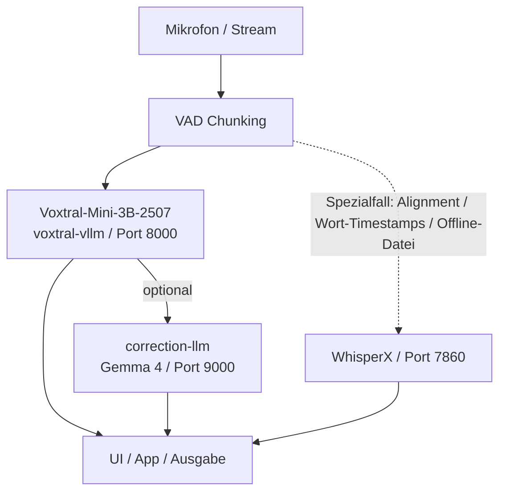

# Voxtral Lokal – Mistral STT auf eigener GPU (Windows 11 + WSL2 / NVIDIA DGX Spark)

Mistral's Voxtral ist ein Open-Weight Speech-to-Text-Modell, das lokal auf NVIDIA GPUs läuft.
Es wird über **vLLM** als OpenAI-kompatibler Server bereitgestellt.

## Links
- Modell: https://huggingface.co/mistralai/Voxtral-Mini-3B-2507
- Realtime-Modell: https://huggingface.co/mistralai/Voxtral-Mini-4B-Realtime-2602
- Docs: https://docs.mistral.ai/capabilities/audio_transcription/
- Blog: https://mistral.ai/news/voxtral-transcribe-2
- DGX-Stack: [README_DGX_SPARK_STACK.md](README_DGX_SPARK_STACK.md)

---

## Verfügbare Modelle

| Modell | Parameter | VRAM (fp16) | Geschwindigkeit | Sprachen |
|--------|-----------|-------------|-----------------|----------|
| `mistralai/Voxtral-Mini-3B-2507` | 3B | ~6-8 GB | Schnell | 9 (inkl. DE) |
| `mistralai/Voxtral-Mini-4B-Realtime-2602` | 4B | ~8-10 GB | Echtzeit-Streaming | 9 (inkl. DE) |
| `mistralai/Voxtral-Small-24B-2507` | 24B | ~48 GB | Langsamer, höchste Qualität | 9 (inkl. DE) |

**Empfehlung:** `Voxtral-Mini-3B-2507` für Batch-Transkription, `Voxtral-Mini-4B-Realtime-2602` für Live-Diktat.

### GPU-Anforderungen

| GPU | VRAM | Mini 3B | Mini 4B Realtime | Small 24B |
|-----|------|---------|------------------|-----------|
| RTX 3060 | 12 GB | ✅ | ✅ | ❌ |
| RTX 3090 / 4090 | 24 GB | ✅ | ✅ | ❌ |
| V100 | 32 GB | ✅ | ✅ | ❌ |
| A100 | 40/80 GB | ✅ | ✅ | ✅ (40GB) |

---

## Voraussetzungen
- **NVIDIA GPU** mit mindestens 12 GB VRAM
- **NVIDIA Treiber** ≥ 525 (für CUDA 12.x) — Windows Game-Ready oder Studio-Treiber
- **WSL2** mit Ubuntu (wird automatisch eingerichtet)
- **Python** ≥ 3.10 (wird in WSL2 installiert)
- **HuggingFace Account** (Modelle erfordern Lizenzzustimmung)

---

## Schnellstart (Windows 11)

### 1. WSL2 einrichten (einmalig)
```powershell
# PowerShell als Administrator ausführen:
.\scripts\01_setup_wsl2.ps1
```

### 2. In WSL2 installieren (einmalig)
```bash
# In WSL2/Ubuntu Terminal:
bash /mnt/d/GitHub/Mistral/HTML/scripts/02_install_voxtral.sh
```

### 3. Server starten
```bash
# Batch-Modell (3B) — für Datei-Transkription:
bash /mnt/d/GitHub/Mistral/HTML/scripts/start_voxtral_batch.sh

# ODER Realtime-Modell (4B) — für Live-Diktat:
bash /mnt/d/GitHub/Mistral/HTML/scripts/start_voxtral_realtime.sh
```

### 4. Testen
```bash
bash /mnt/d/GitHub/Mistral/HTML/scripts/test_voxtral.sh
```

---

## Schnellstart (NVIDIA DGX Spark / Blackwell / ARM64)

### Empfehlung für mehrere parallele User

Wenn bis zu ~10 Nutzer parallel verarbeitet werden sollen, ist auf dem DGX Spark **vLLM** der empfohlene Pfad.
Der direkte `transformers`-Server in `voxtral_server.py` bleibt als einfacher Fallback für Einzelbetrieb oder Debugging erhalten.

### Benchmark-Ergebnis für kurzen Satz-/VAD-Chunk-Betrieb

Für den realen Einsatz mit kurzen VAD-Chunks (typisch ein kurzer Satz, keine langen Audiodateien) wurde `mistralai/Voxtral-Mini-3B-2507` direkt gegen `WhisperX large-v3` verglichen.
Das Ergebnis spricht in diesem Modus klar für Voxtral.

| Nutzer | Voxtral Ø Latenz | Voxtral Throughput | Voxtral GPU | WhisperX Ø Latenz | WhisperX Throughput | WhisperX GPU |
|---:|---:|---:|---:|---:|---:|---:|
| 1 | `0.31s` | `2.48 r/s` | `78.7%` | `0.48s` | `1.70 r/s` | `38.3%` |
| 2 | `0.34s` | `4.75 r/s` | `92.4%` | `0.76s` | `2.23 r/s` | `51.3%` |
| 3 | `0.33s` | `7.18 r/s` | `92.3%` | `1.13s` | `2.28 r/s` | `54.2%` |
| 4 | `0.33s` | `9.74 r/s` | `92.4%` | `1.52s` | `2.28 r/s` | `53.0%` |
| 5 | `0.33s` | `11.92 r/s` | `92.4%` | `1.94s` | `2.30 r/s` | `52.4%` |
| 6 | `0.34s` | `14.07 r/s` | `92.4%` | `2.24s` | `2.38 r/s` | `62.4%` |

Fazit aus dem Test:

- Voxtral bleibt bis `6` parallele Nutzer nahezu latenzstabil.
- WhisperX verliert unter Parallelität deutlich schneller an Reaktionszeit.
- Für kurze Online-Chunks ist `Voxtral-Mini-3B-2507` auf dem Spark klar besser geeignet als `WhisperX large-v3`.
- WhisperX bleibt sinnvoll, wenn segmentgenaue Timestamps oder ein nachgelagerter Offline-Lauf wichtiger sind als maximale Parallelität.

### Empfohlene Routing-Regeln

Für den praktischen Einsatz mit VAD-Chunks kann die Entscheidung sehr einfach gehalten werden:

- **Kurzer Satz / kurzer VAD-Chunk / Online-Modus** → `Voxtral-Mini-3B-2507`
- **Kurzer Chunk + optionale Textkorrektur** → `Voxtral-Mini-3B-2507` + Korrektur-LLM
- **Wortgenaue Timestamps / Segment-Alignment** → `WhisperX`
- **Längere Offline-Dateien mit nachträglicher Analyse** → `WhisperX`, optional danach Korrektur-LLM

Damit gilt für diesen Stack:

- Voxtral ist der Standardpfad für die eigentliche Online-Erkennung.
- WhisperX ist der Spezialpfad für Alignment und Offline-Nachbearbeitung.

### Architekturdiagramm für den Online-Pfad

```text
Mikrofon / Stream
	  |
	  v
  VAD Chunking
	  |
	  v
+-------------------------+
| Voxtral-Mini-3B-2507    |
| voxtral-vllm / Port 8000|
+------------+------------+
		   |
		   | optional
		   v
+-------------------------+
| correction-llm          |
| Gemma 4 / Port 9000     |
+------------+------------+
		   |
		   v
	UI / App / Ausgabe

Spezialfall statt Voxtral:
  Alignment / Wort-Timestamps / Offline-Datei
			   |
			   v
	   WhisperX / Port 7860
```



### Produktionspfad: DGX Spark mit vLLM

Diese Variante nutzt einen Docker-Container mit `vllm serve` und ist auf parallele Requests ausgelegt.

#### 1. Dateien auf den DGX Spark kopieren
```powershell
pwsh -File .\scripts\deploy_voxtral_to_dgx.ps1 -RemoteUser <dein-user>
```

#### 2. vLLM-Setup auf dem DGX Spark starten
```bash
cd ~/voxtral-setup
chmod +x 04_install_voxtral_dgx_spark_container.sh
./04_install_voxtral_dgx_spark_container.sh
```

Das Skript erledigt:
- Docker + NVIDIA Container Toolkit einrichten
- Login nach `nvcr.io` per NGC API Key
- Abfrage eines Hugging-Face-Tokens für Modellzugriff
- Build eines ARM64-geeigneten `vLLM`-Images auf Basis von `nvcr.io/nvidia/pytorch:26.03-py3`
- Einrichtung eines `systemd`-Dienstes `voxtral-vllm`

#### 3. Service starten und prüfen
```bash
sudo systemctl start voxtral-vllm
sudo systemctl status voxtral-vllm --no-pager -l
curl http://127.0.0.1:8000/health
```

#### 4. Standard-Tuning für Parallelität

Die vLLM-Variante startet mit diesen Defaults:
- `--max-num-seqs 10`
- `--max-num-batched-tokens 8192`
- `--max-model-len 4096`
- `--gpu-memory-utilization 0.82`
- `--kv-cache-dtype fp8`

Diese Werte sind ein praxisnaher Startpunkt für bis zu ca. 10 parallele Kurz-Requests.
Für längere Audios oder niedrigere Latenz kann später nachjustiert werden.

#### 5. Audio-Test
```bash
curl -X POST http://127.0.0.1:8000/v1/audio/transcriptions \
	-F "file=@$HOME/audio.wav" \
	-F "language=de" \
	-F "response_format=json"
```

---

### Fallback: nativer DGX-Spark-Server ohne vLLM

Diese Variante ist für ein headless DGX-Spark-System mit Ubuntu und ARM64 gedacht.
Der Server läuft nativ auf dem Gerät und ist danach im LAN über Port `8000` erreichbar.

### Voraussetzungen auf dem DGX Spark
- Ubuntu / NVIDIA DGX Spark OS mit funktionierendem `nvidia-smi`
- Python 3.12+ und `sudo`
- Netzwerkzugriff auf Hugging Face
- Lizenzfreigabe für das gewünschte Modell auf Hugging Face

### 1. Dateien vom Windows-Rechner auf den DGX Spark kopieren
```powershell
pwsh -File .\scripts\deploy_voxtral_to_dgx.ps1 -RemoteUser <dein-user>
```

Das kopiert folgende Dateien nach `~/voxtral-setup` auf dem DGX Spark:
- `voxtral_server.py`
- `scripts/03_install_voxtral_dgx_spark.sh`
- `scripts/04_install_voxtral_dgx_spark_container.sh`

### 2. Native Installation auf dem DGX Spark starten
```bash
cd ~/voxtral-setup
chmod +x 03_install_voxtral_dgx_spark.sh
./03_install_voxtral_dgx_spark.sh
```

Das Skript erledigt:
- Installation der Ubuntu-Basis-Pakete
- Anlage eines Python-venv unter `~/voxtral-env`
- CUDA-fähige PyTorch-Installation für ARM64 (`cu130`)
- Installation von FastAPI, Transformers, `mistral-common[audio]` und Audio-Dependencies
- Hugging-Face-Login via `~/voxtral-env/bin/hf`
- Einrichtung eines `systemd`-Dienstes namens `voxtral`

### 3. Service starten und prüfen
```bash
sudo systemctl start voxtral
sudo systemctl status voxtral --no-pager -l
curl http://127.0.0.1:8000/health
```

Von Windows aus:
```powershell
pwsh -File .\scripts\test_voxtral_remote.ps1 -ServerUrl http://<DGX-IP>:8000
```

### 4. Ersten Audio-Request testen
```bash
curl -X POST http://127.0.0.1:8000/v1/audio/transcriptions \
	-F "file=@$HOME/audio.wav" \
	-F "language=de" \
	-F "response_format=json"
```

Hinweise:
- Der erste Request lädt das Voxtral-Modell in den Speicher und dauert deutlich länger.
- `/health` zeigt davor oft `model_loaded: false`; das ist normal.
- Das Modell wird nach 60 Sekunden Inaktivität automatisch wieder entladen.

### 5. Hotfix für bestehende DGX-Installationen

Falls ein bereits laufender DGX-Spark-Server noch den Fehler
`NameError: name 'TranscriptionRequest' is not defined` wirft, kann das lokale Reparatur-Skript genutzt werden:

```powershell
pwsh -ExecutionPolicy Bypass -File .\scripts\fix_voxtral_remote.ps1
```

Das Skript:
- lädt die aktuelle `voxtral_server.py` auf den DGX Spark hoch
- installiert `mistral-common[audio]` im Remote-venv
- startet den `voxtral`-Service neu

---

## Env-Variablen

| Variable | Default | Beschreibung |
|----------|---------|-------------|
| `VOXTRAL_LOCAL_URL` | `http://localhost:8000` | URL des vLLM-Servers (HTTP + WS) |
| `VOXTRAL_LOCAL_MODEL` | `mistralai/Voxtral-Mini-3B-2507` | HuggingFace Modell-ID (Batch) |

> **WebSocket-URL:** Wird automatisch aus `VOXTRAL_LOCAL_URL` abgeleitet:
> `http://localhost:8000` → `ws://localhost:8000/v1/realtime`

---

## Troubleshooting

### "CUDA out of memory"
```bash
--max-model-len 4096    # Kleinere max-model-len
--max-num-seqs 1        # Weniger parallele Anfragen
```

### "Model not found" / 403
- HuggingFace Login prüfen: `hf auth whoami`
- Lizenz auf der Modell-Seite akzeptiert?
- Token hat Read-Berechtigung?

### DGX Spark: `NameError: name 'TranscriptionRequest' is not defined`
- Ursache: In manchen `transformers`-Versionen fehlt ein Voxtral-Import zur Laufzeit.
- Lösung: aktuelle `voxtral_server.py` verwenden und `mistral-common[audio]` installiert haben.
- Reparatur lokal vom Windows-Rechner aus:
	- `pwsh -ExecutionPolicy Bypass -File .\scripts\fix_voxtral_remote.ps1`

### DGX Spark: `curl http://0.0.0.0:8000/health` antwortet nicht
- `0.0.0.0` ist die Bind-Adresse des Servers, nicht die Client-Adresse.
- Verwende stattdessen `http://127.0.0.1:8000/health` oder `http://<DGX-IP>:8000/health`.

### DGX Spark: erster Request hängt minutenlang
- Beim ersten Request lädt `VoxtralForConditionalGeneration.from_pretrained(...)` das Modell lokal.
- Mit `journalctl -u voxtral -f` prüfen, ob gerade `Lade Voxtral-Modell auf GPU...` erscheint.
- Sobald das Modell im Cache liegt, sind Folge-Requests deutlich schneller.

### DGX Spark: mehrere parallele User / hoher Durchsatz
- Dafür die **vLLM-Variante** mit `04_install_voxtral_dgx_spark_container.sh` verwenden.
- Standardmäßig startet sie mit `--max-num-seqs 10` und `--performance`-tauglichen Batch-Settings.
- Für noch mehr Parallelität zuerst die Batch-Latenz messen und dann `VOXTRAL_MAX_NUM_SEQS` bzw. `VOXTRAL_MAX_BATCHED_TOKENS` anpassen.

### Server startet, aber GPU wird nicht genutzt
```bash
python3 -c "import torch; print(torch.cuda.is_available(), torch.cuda.get_device_name(0))"
```

### WebSocket verbindet nicht (Realtime-Modus)
- **Falsches Modell?** `/v1/realtime` existiert nur mit dem Realtime-Modell
- **Port blockiert?** `lsof -i :8000` prüfen
- **Firewall?** In PowerShell: `netsh interface portproxy add v4tov4 listenport=8000 listenaddress=0.0.0.0 connectport=8000 connectaddress=$(wsl hostname -I)`
